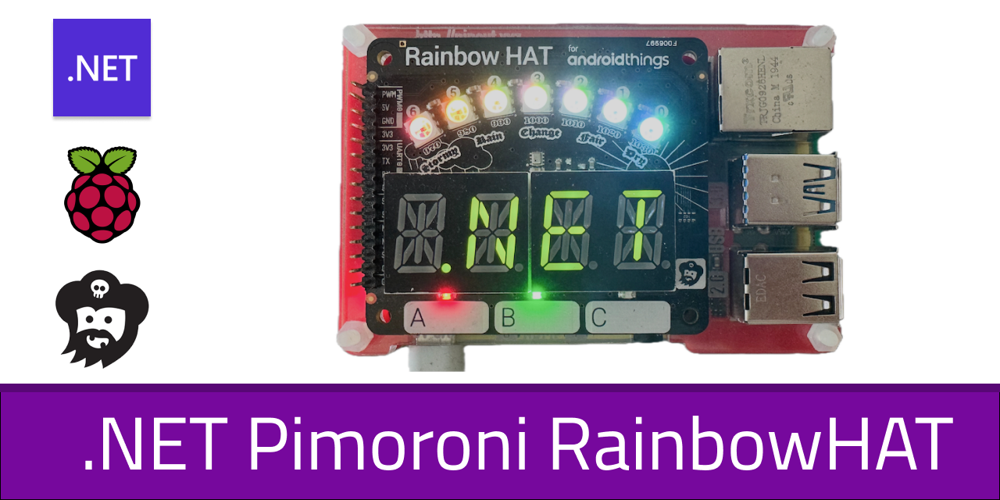

# 🌈 Rainbow HAT for .NET IoT

This repository contains a comprehensive C# library for interacting with the [Pimoroni Rainbow HAT](https://shop.pimoroni.com/products/rainbow-hat-for-android-things) using .NET IoT. The Rainbow HAT is a beautiful add-on board for Raspberry Pi that includes various sensors and visual elements.

<center>
   
</center>

## 🎯 Features

The library provides easy-to-use controllers for all Rainbow HAT components:

- **📊 Alphanumeric Display** - Four-digit display with scrolling text support
- **💡 RGB LEDs** - Individual control of red, green, and blue status LEDs
- **🎨 APA102 LED Strip** - Seven RGB LEDs with brightness control
- **🌡️ BMP280 Sensor** - Temperature and pressure readings
- **🔘 Touch Buttons** - Three capacitive touch buttons with event handling
- **🔊 Buzzer** - PWM-controlled piezo buzzer

## 🚀 Getting Started

### Prerequisites

- Raspberry Pi (any model)
- Pimoroni Rainbow HAT
- .NET 9.0 SDK
- Basic knowledge of C# and .NET

### Installation

1. Clone this repository:
```bash
git clone https://github.com/yourusername/Rainbow.git
cd Rainbow
```

2. Build the project:
```bash
dotnet build
```

3. Run the demo:
```bash
dotnet run
```

### Basic Usage

```csharp
// Display scrolling text
using var display = new SegmentDisplayController();
await display.DisplayScrollingText("Hello World!");

// Control RGB LEDs
using var lights = new LightController();
lights.Red.TurnToState(Light.Target.On);

// Read temperature
using var sensor = new Bmp280Controller();
Console.WriteLine($"Temperature: {sensor.Temperature?.DegreesCelsius:F1}°C");

// Play a tone
using var buzzer = new BuzzerController();
buzzer.PlayNote(440, 1.0); // Play A4 for 1 second
```

## 📖 Documentation

Each component has its own controller class with comprehensive XML documentation:

- `SegmentDisplayController` - Manages the alphanumeric display
- `LightController` - Controls individual RGB LEDs
- `Apa102Controller` - Handles the APA102 LED strip
- `Bmp280Controller` - Interfaces with the temperature/pressure sensor
- `ButtonController` - Manages touch button events
- `BuzzerController` - Controls the piezo buzzer

## 🎮 Demo Application

The project includes a comprehensive demo in `Samples.cs` that showcases all features:

```csharp
await Samples.FullTourAsync();
```

## 🔧 Hardware Components

The Rainbow HAT includes:
- HT16K33 LED Matrix Driver
- BMP280 Temperature/Pressure Sensor
- APA102 LED Strip
- Piezo Buzzer
- Three Capacitive Touch Buttons
- Three RGB Status LEDs

## 📜 License

This project is licensed under the MIT License - see the LICENSE file for details.

## 🤝 Contributing

Contributions are welcome! Please feel free to submit a Pull Request.

## ❤️ More IoT projects of mine
I like to tinker around with Raspberry Pis, I created a couple of educational apps and scripts regarding the Pi and sensors - mostly from Pimoroni.

### .NET on Raspberry Pi 
- [dotnet-iot-raspberrypi-blinkt](https://github.com/tscholze/dotnet-iot-raspberrypi-blinkt) A C# .NET implementation for the Pimoroni Blinkt! LED board on a Raspberry Pi.
- [dotnet-iot-raspberrypi-enviro](https://github.com/tscholze/dotnet-iot-raspberrypi-enviro) A C# .NET implementation for the Pimoroini Enviro HAT with BMP, TCS and more sensors
- [dotnet-iot-raspberrypi-rainbow](https://github.com/tscholze/dotnet-iot-raspberrypi-rainbow) A C# .NET implementation for the Pimoroini Rainbow HAT with Lights, BMP, segment displays and more

### Windows 10 IoT Core apps
- [dotnet-iot-homebear-blinkt](https://github.com/tscholze/dotnet-iot-homebear-blinkt) Windows 10 IoT Core UWP app that works great with the Pimoroni Blinkt! LED Raspberry Pi HAT.
- [dotnet-iot-homebear-tilt](https://github.com/tscholze/dotnet-iot-homebear-tilt) Windows 10 IoT Core UWP app that works great with the Pimoroni Pan and Tilt HAT (PIC16F1503)
- [dotnet-iot-homebear-rainbow](https://github.com/tscholze/dotnet-iot-homebear-rainbow) Windows 10 IoT Core UWP app that works great with the Pimoroni RainbowHAT

### Android Things apps
- [java-android-things-firebase-pager](https://github.com/tscholze/java-android-things-firebase-pager) An Android Things app that displays a Firebase Cloud Messaging notification on a alphanumeric segment control (Rainbow HAT)
- [java-android-things-tobot](https://github.com/tscholze/java-android-things-tobot) An Android Things an Google Assistant app to controll a Pimoroni STS vehicle by web and voice

### Python scripts
- [python-enviro-gdocs-logger](https://github.com/tscholze/python-enviro-gdocs-logger) Logs values like room temperature and more to a Google Docs Sheet with graphs
- [python-enviro-excel-online-logger](https://github.com/tscholze/python-enviro-excel-online-logger) Logs values like room temperature and more to a M365 Excel Sheet with graphs
- [python-enviro-azure-logger](https://github.com/tscholze/python-enviro-azure-logger) Logs values like room temperature and more to an Azure IoT Hub instance

## 🙏 Acknowledgments

- Pimoroni for the excellent Rainbow HAT hardware
- .NET IoT team for the System.Device.Gpio library
- IoT.Device.Bindings project for the BMP280 driver
